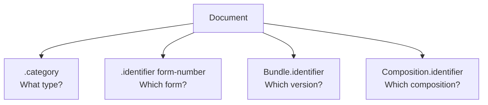

### Document categories and identifiers

DHP uses several mechanisms to classify and identify clinical documents:
- Category codes - the main way to identify types of resources
- External identifiers - link to official form or template numbers when present
- Instance identifiers - unique UUIDs to distinguish individual document instances



### Category codes

Category codes are the primary method for identifying document types. Use `Composition.category` or `CarePlan.category` with codes from [DocumentCategoryCS](CodeSystem-document-category-cs.html).

```json
{
  "resourceType": "Composition",
  "category": [{
    "coding": [{
      "system": "https://terminology.dhp.uz/fhir/integrations/CodeSystem/document-category-cs",
      "code": "form-094",
      "display": "Certificate of disability due to intoxication"
    }]
  }]
}
```

Categories are based on Ministry of Health standardized forms.

### External identifiers

When a document has an official form number or template number, they are recorded in `.identifier`. Not all documents have external identifiers - use them when present.

#### Form numbers

Official form numbers (e.g., Form 094):

```json
{
  "identifier": [{
    "system": "https://dhp.uz/fhir/core/sid/doc/uz/form-number",
    "value": "094"
  }]
}
```

#### Template numbers

Template identifiers (distinct from form numbers):

```json
{
  "identifier": [{
    "system": "https://dhp.uz/fhir/core/sid/doc/uz/template-number",
    "value": "094"
  }]
}
```

### Instance identifiers

Individual instances are distinguished using UUID format in `.identifier`.

For [FHIR document Bundles](https://hl7.org/fhir/documents.html), two identifiers are used:
- `Bundle.identifier` - unique per document instance, never reused
- `Composition.identifier` - consistent across all documents derived from the same composition

When a document is updated (e.g., a form is created and later modified), `Composition.identifier` stays the same while `Bundle.identifier` will be different between versions. This allows systems to recognize that two document bundles represent different versions of the same underlying clinical information.

```json
{
  "resourceType": "Bundle",
  "identifier": {
    "system": "urn:ietf:rfc:3986",
    "value": "urn:uuid:550e8400-e29b-41d4-a716-446655440000"
  },
  "entry": [{
    "resource": {
      "resourceType": "Composition",
      "identifier": {
        "system": "urn:ietf:rfc:3986",
        "value": "urn:uuid:661f9511-f30c-52e5-b827-557766551111"
      }
    }
  }]
}
```

For standalone resources (e.g., CarePlan), use the resource's own `.identifier`.

### Finding documents

A [document Bundle](https://hl7.org/fhir/documents.html) is searched through its Composition, not through its contents. `Bundle` itself has only five search parameters, and the one that reaches the clinical content is `composition`, which resolves to the first entry of the bundle:

| Parameter | Type | Expression |
|-----------|------|------------|
| `composition` | reference | `Bundle.entry[0].resource as Composition` |
| `identifier` | token | `Bundle.identifier` |
| `type` | token | `Bundle.type` |
| `timestamp` | date | `Bundle.timestamp` |

Chaining through `composition` gives access to the Composition search parameters, including `category`, `identifier`, `subject`, `encounter` and `date`. Since the FHIR document rules require the Composition to be the first entry, this always addresses the document's Composition.

Because the category is the primary classifier, searching by category is the usual way to find all documents of one type. All Form 066 documents:

```
GET [base]/Bundle?type=document&composition.category=https://terminology.dhp.uz/fhir/integrations/CodeSystem/document-category-cs|form-066
```

The form number is an alternative when the caller works from the official form reference:

```
GET [base]/Bundle?type=document&composition.identifier=https://dhp.uz/fhir/core/sid/doc/uz/form-number|066
```

Form 066 documents for a single patient:

```
GET [base]/Bundle?type=document&composition.category=https://terminology.dhp.uz/fhir/integrations/CodeSystem/document-category-cs|form-066&composition.subject=Patient/123
```

The two instance identifiers answer different questions. `Bundle.identifier` retrieves one exact document instance:

```
GET [base]/Bundle?identifier=urn:ietf:rfc:3986|urn:uuid:760e8400-e29b-41d4-a716-446655440066
```

`Composition.identifier` retrieves every version of the same document, each version being a separate bundle with its own `Bundle.identifier`:

```
GET [base]/Bundle?type=document&composition.identifier=urn:ietf:rfc:3986|urn:uuid:861f9511-f30c-52e5-b827-557766550666
```

### Summary

| Element | Purpose | Example |
|---------|---------|---------|
| `.category` | Classify the document type | "This is a disability certificate" |
| `.identifier` (form/template) | Link to external reference | "This is Form 094" |
| `Bundle.identifier` | Unique document instance | v1: `urn:uuid:aaa...`, v2: `urn:uuid:bbb...` |
| `Composition.identifier` | Composition identity | v1 & v2: `urn:uuid:ccc...` |

### Example

See [Form 095 CarePlan Example](CarePlan-Form095CarePlanExample.html) for a complete example showing category, form number, and instance identifier.
