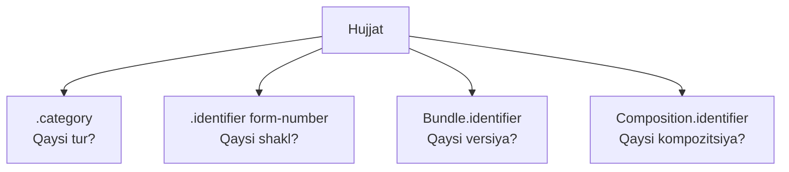

> **Mashina tarjimasi, inson tomonidan tekshirilishi zarur.** Ushbu sahifa ingliz tilidan sun'iy intellekt yordamida avtomatik tarjima qilingan va hali muharrir tomonidan tekshirilmagan. Har qanday nomuvofiqlikda asl inglizcha versiya ustuvor hisoblanadi.

### Hujjat kategoriyalari va identifikatorlari

DHP klinik hujjatlarni tasniflash va identifikatsiyalash uchun bir nechta mexanizmdan foydalanadi:
- Kategoriya kodlari - resurs turlarini aniqlashning asosiy usuli
- Tashqi identifikatorlar - mavjud bo'lganda rasmiy shakl yoki shablon raqamlariga bog'lanish
- Nusxa identifikatorlari - hujjatning alohida nusxalarini farqlash uchun noyob UUID'lar



### Kategoriya kodlari

Kategoriya kodlari hujjat turlarini aniqlashning asosiy usuli hisoblanadi. [DocumentCategoryCS](CodeSystem-document-category-cs.html) kodlari bilan `Composition.category` yoki `CarePlan.category` dan foydalaning.

```json
{
  "resourceType": "Composition",
  "category": [{
    "coding": [{
      "system": "https://terminology.dhp.uz/fhir/integrations/CodeSystem/document-category-cs",
      "code": "form-094",
      "display": "Mast holati sababli mehnatga layoqatsizlik to'g'risida ma'lumotnoma"
    }]
  }]
}
```

Kategoriyalar Sog'liqni saqlash vazirligining standartlashtirilgan shakllariga asoslanadi.

### Tashqi identifikatorlar

Agar hujjatning rasmiy shakl yoki shablon raqami bo'lsa, ular `.identifier` da qayd etiladi. Hamma hujjatlarda tashqi identifikator bo'lavermaydi - ulardan mavjud bo'lgan hollarda foydalaning.

#### Shakl raqamlari

Rasmiy shakl raqamlari (masalan, 094-shakl):

```json
{
  "identifier": [{
    "system": "https://dhp.uz/fhir/core/sid/doc/uz/form-number",
    "value": "094"
  }]
}
```

#### Shablon raqamlari

Shablon identifikatorlari (shakl raqamlaridan farq qiladi):

```json
{
  "identifier": [{
    "system": "https://dhp.uz/fhir/core/sid/doc/uz/template-number",
    "value": "094"
  }]
}
```

### Nusxa identifikatorlari

Alohida nusxalar `.identifier` dagi UUID formati yordamida farqlanadi.

[FHIR document Bundle](https://hl7.org/fhir/documents.html) uchun ikkita identifikator ishlatiladi:
- `Bundle.identifier` - hujjatning har bir nusxasi uchun noyob, hech qachon qayta ishlatilmaydi
- `Composition.identifier` - bir xil kompozitsiya asosida yaratilgan barcha hujjatlar uchun bir xil

Hujjat yangilanganda (masalan, shakl yaratilib, keyin o'zgartirilganda) `Composition.identifier` o'zgarmaydi, `Bundle.identifier` esa versiyalar orasida farq qiladi. Bu tizimlarga ikkita hujjat Bundle'i bir xil klinik ma'lumotning turli versiyalari ekanini aniqlash imkonini beradi.

```json
{
  "resourceType": "Bundle",
  "identifier": {
    "system": "urn:ietf:rfc:3986",
    "value": "urn:uuid:550e8400-e29b-41d4-a716-446655440000"
  },
  "entry": [{
    "resource": {
      "resourceType": "Composition",
      "identifier": {
        "system": "urn:ietf:rfc:3986",
        "value": "urn:uuid:661f9511-f30c-52e5-b827-557766551111"
      }
    }
  }]
}
```

Mustaqil resurslar uchun (masalan, CarePlan) resursning o'z `.identifier` idan foydalaning.

### Hujjatlarni qidirish

[Hujjat Bundle'i](https://hl7.org/fhir/documents.html) uning tarkibi bo'yicha emas, balki Composition'i orqali qidiriladi. `Bundle` ning o'zida atigi beshta qidiruv parametri bor va klinik tarkibga yo'l ochadigani `composition` bo'lib, u Bundle'ning birinchi elementiga ishora qiladi:

| Parametr | Turi | Ifoda |
|----------|------|-------|
| `composition` | reference | `Bundle.entry[0].resource as Composition` |
| `identifier` | token | `Bundle.identifier` |
| `type` | token | `Bundle.type` |
| `timestamp` | date | `Bundle.timestamp` |

`composition` orqali zanjirli qidiruv Composition'ning qidiruv parametrlariga, jumladan `category`, `identifier`, `subject`, `encounter` va `date` ga kirish imkonini beradi. FHIR hujjat qoidalari Composition birinchi element bo'lishini talab qilgani uchun bu doimo hujjatning Composition'iga murojaat qiladi.

Kategoriya asosiy tasniflagich bo'lgani sababli, bir turdagi barcha hujjatlarni topishning odatiy yo'li kategoriya bo'yicha qidirishdir. Barcha 066-shakl hujjatlari:

```
GET [base]/Bundle?type=document&composition.category=https://terminology.dhp.uz/fhir/integrations/CodeSystem/document-category-cs|form-066
```

Shakl raqami rasmiy shakl raqami bilan ishlaydiganlar uchun muqobil usul:

```
GET [base]/Bundle?type=document&composition.identifier=https://dhp.uz/fhir/core/sid/doc/uz/form-number|066
```

Bitta bemorning 066-shakl hujjatlari:

```
GET [base]/Bundle?type=document&composition.category=https://terminology.dhp.uz/fhir/integrations/CodeSystem/document-category-cs|form-066&composition.subject=Patient/123
```

Ikki nusxa identifikatori turli savollarga javob beradi. `Bundle.identifier` hujjatning aniq bitta nusxasini qaytaradi:

```
GET [base]/Bundle?identifier=urn:ietf:rfc:3986|urn:uuid:760e8400-e29b-41d4-a716-446655440066
```

`Composition.identifier` esa bir hujjatning barcha versiyalarini qaytaradi; har bir versiya o'z `Bundle.identifier` iga ega alohida Bundle bo'ladi:

```
GET [base]/Bundle?type=document&composition.identifier=urn:ietf:rfc:3986|urn:uuid:861f9511-f30c-52e5-b827-557766550666
```

### Xulosa

| Element | Maqsadi | Misol |
|---------|---------|-------|
| `.category` | Hujjat turini tasniflash | "Bu mehnatga layoqatsizlik ma'lumotnomasi" |
| `.identifier` (shakl/shablon) | Tashqi manbaga bog'lash | "Bu 094-shakl" |
| `Bundle.identifier` | Hujjatning noyob nusxasi | v1: `urn:uuid:aaa...`, v2: `urn:uuid:bbb...` |
| `Composition.identifier` | Kompozitsiya identifikatori | v1 va v2: `urn:uuid:ccc...` |

### Misol

Kategoriya, shakl raqami va nusxa identifikatori ko'rsatilgan to'liq misol uchun [095-shakl CarePlan misoli](CarePlan-Form095CarePlanExample.html) ga qarang.
